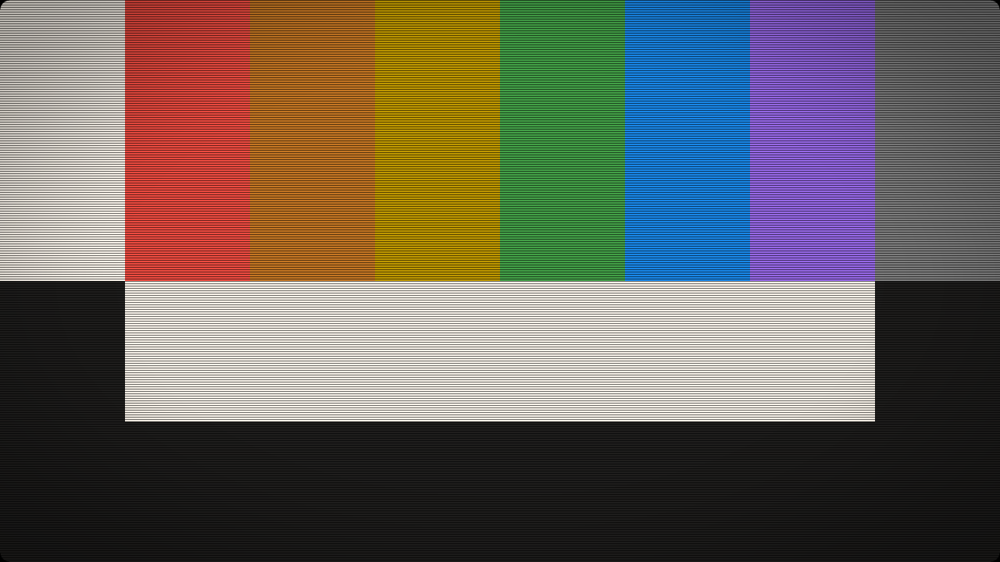

# crt

`clockwork-crt` -- a global CRT screen filter for the ClockworkPi uConsole: scanlines,
an optional phosphor mask, vignette, and rounded tube corners, drawn as one fullscreen
click-through ARGB overlay that mutter alpha-blends over the whole desktop. Ships with a
keyboard-first control panel in the house TUI style.

*The `tube` preset composited over synthetic color bars -- generated off-device with
`clockwork-crt --render-demo out.ppm 1280x720`. The overlay is rendered once per config
change into a server-side pixmap, so the daemon does zero per-frame work.*

- **Runs on:** pi (the uConsole). Authored on the Mac, deployed to the Pi.
- **Full documentation:** `docs/crt-filter.md`.
- **Config:** `~/.config/clockwork/display-crt` (key=value, fail-soft, validated by
  `clockwork-crt --check`). Compiled defaults are the `tube` preset with the filter off.

## Layout

| Path | What |
| --- | --- |
| `bin/clockwork-crt` | the filter: render engine, overlay daemon, CLI, and control panel |
| `config/desktop/CRT-Filter.desktop` | rofi / menu launcher entry |
| `config/desktop/icons/clockwork-crt.svg` | PiXombre tube-TV app icon |
| `docs/crt-filter.md` | the reference page |

One Python file, no build step. Pi dependencies: `python3-xlib` (required) and
`python3-numpy` (without it a slower pure-Python fallback renders scanlines and mask only).

## Deploy

The Pi installer in [Sh-ui/clockwork-lab](https://github.com/Sh-ui/clockwork-lab)
(`bin/install-pi.sh`) symlinks `bin/clockwork-crt` into `/usr/local/bin`, places the
launcher, and renders the icon into both PiXombre sets. Deployed copies are symlinks back
into this clone, so an edit here is live on the next launch: edit in the vault, never the
deployed copy.

`clockwork-ensure` runs `clockwork-crt --apply` at login, which is what makes the filter
reboot-durable.

## License

MIT -- see [LICENSE](LICENSE).
